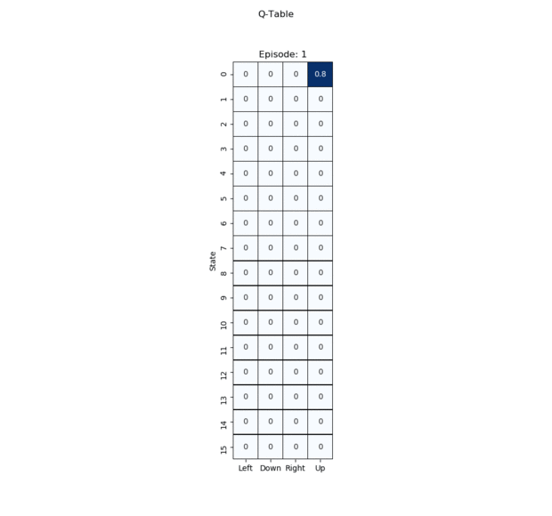

```python
import numpy as np
import pandas as pd
import seaborn as sns
import matplotlib.pyplot as plt
%matplotlib inline 

'''
Intuitive video about sparse rewards:
    <https://www.youtube.com/watch?v=0Ey02HT_1Ho>
'''

# Environment

import gym
env = gym.make('FrozenLake-v0')

EPISODES = 200

total_states = env.observation_space.n
actions_per_state = env.action_space.n
print('Number of states: ', total_states)
print('Number of actions per state: ', actions_per_state)
print('Number of episodes to run: ', EPISODES)

actions = ['Left', 'Down', 'Right', 'Up']
states = ['S',' ',' ',' ', 'F','H','F','H','F','F','F','H','H','F','F','G']
world = [['S',' ',' ',' '],
         [' ',' ',' ','H'],
         [' ',' ',' ','H'],
         ['H',' ',' ','G']]


# Helper function to track movement
def draw_world(w, s):
    i = int(np.floor(s / 4))
    j = s % 4
    w[i,j] = 'X'
    print(w)
```

    Number of states:  16
    Number of actions per state:  4
    Number of episodes to run:  200


```python
# Q-Table

q = np.zeros((total_states, actions_per_state), dtype='float')
Q = pd.DataFrame(q, columns=actions)
Q.reset_index(inplace=True)
Q.rename(columns={'index':'State'}, inplace=True)
Q.set_index('State', inplace=True)

# Helper functions to draw, update and get values of the table
def draw_Table(Q):
    table = sns.heatmap(Q, cmap='Blues', annot=True, linewidths=.5, cbar=False, 
                linecolor='black', square=True)
    return table  

# Helper function to sincronize the pandas DataFrame (Q) with the numpy array (q)
def set_Q(q): 
    global Q
    Q.iloc[:,:] = q
```


```python
# Q-Learning Algorithm

lr = .8
y = .9
rList = []

    
plt.ion()
plt.figure(figsize = (10,10)).suptitle('Q-Table')
previous = draw_Table(Q)

for i in range(EPISODES):
    
    j = 0
    s = env.reset()

    print('Episode [{}/{}]'.format(i,EPISODES))
    
    rAll = 0
    end_state = False
    
    while j < 99:
        
        j+=1
        # Print slowly the first steps and then go fast
        exp = np.exp(-j*(i+1)) 
        
        # Choose action greedily
        a = np.argmax(q[s,:] + np.random.randn(1, env.action_space.n) * (1./ (i+1)))
        
        # Collect reward and reach new state
        s1,r,end_state,inf = env.step(a)
        
        '''
        In order to make it visual, we are giving a reward here just by making one action.
        If not, the values of Q will not be updated until the agent actually reached goal.
        Therefore, r+=1 should be remove in the real implementation.
        '''
        r += 1
        
        # Update Q-Table with new knowledge
        q[s,a] = round(q[s,a] + lr*(r + y*np.max(q[s1,:]) - q[s,a]), 2)
        
        # Update the dataframe. We are playing with the numpy array for easy the notation
        set_Q(q)
        
        # Update the new Q-Table visualization
        if 'previous' in globals(): 
            previous.axes.clear()
        previous = draw_Table(Q).set_title('Episode: {}'.format(i+1))
        plt.pause(1 * exp)
        
        # Rules to save figs to make later GIF        
        if i < 10 or ((not i < 10 and i % 10 ==0) and j == 0):
            plt.savefig('imgs/episode_{}_iter{}'.format(i,j))
        
        # Accumulate reward
        rAll += r
        
        # Move to next state
        s = s1
        
        if end_state == True: 
            break        

    rList.append(rAll)

plt.ioff()
plt.show()
```


```python
# Then I created a GIF with the images generated:
```


