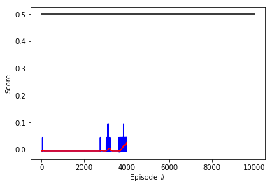

# Tennis Project


## Algorithm: Deep Deterministic Policy Gradient
The RL algorithm used to solve this project is Deep Deterministic Policy Gradient, which was introduced by DeepMind in the publication ["Continuous control with deep reinforcement learning"][paper].  

DDPG solves the problem of having a continuous action space.  
DDPG uses the Actor-Critic framework, but it is considered by some researchers as an extension of DQN since uses the target network key idea. The critic is used to approximate the maximizer over the *q-values* of the next state, instead of being used as a learned baseline.   

##### Actor
Is used to approximate the optimal policy ***deterministically***. It always outputs the best believed action. Stochastic methods on the other hand want to learn a probability distribution over actions.  
This actor is learning the *argmaxQ(s,a)* action.

##### Critic
It does the policy evaluation step. Therefore, it learns to evaluate the optimal action-value funtion by using the actors best believed actions.  

##### Replay Buffer
DDPG uses a Replay Buffer to decorrelate the tuples of experiences obtained sequentially.  
However, the uptades are slightly different than how the Replay Buffer works on other algorithms like DQN.  

This time, they are called ***soft updates***. 
This strategy consists on *slowly blending* the Regular Network weights into the Target weigths. Every timestep, the Target is 99% weights of its own and 1% the weights of the Regular Network.

This is opposed to the DQN implementation where the Target Network is updated every 10000 steps by coping the weights of the Regular Network into the Target Network. The Target Network then is fixed for a long time and then it sufferts a big update, intead of the slow blending mentioned above.


```python
# Init Training
# -------------

results = dict()
agent, scores, avg_scores = train(ENV)
```

    Loading environmnet...
    
    +-----------+--------+--------------+-------------+
    | Max Iters | Epochs | Learn Period | Num Samples |
    +-----------+--------+--------------+-------------+
    |    100    | 10000  |      20      |     10      |
    +-----------+--------+--------------+-------------+


    INFO:unityagents:
    'Academy' started successfully!
    Unity Academy name: Academy
            Number of Brains: 1
            Number of External Brains : 1
            Lesson number : 0
            Reset Parameters :
    		
    Unity brain name: TennisBrain
            Number of Visual Observations (per agent): 0
            Vector Observation space type: continuous
            Vector Observation space size (per agent): 8
            Number of stacked Vector Observation: 3
            Vector Action space type: continuous
            Vector Action space size (per agent): 2
            Vector Action descriptions: , 


    Using brain TennisBrain
    Loading agent...
    
    Capacity of the Actor (# of parameters):  39554
    Capacity of the Critic (# of parameters):  105729
    Initializing training...
    
    Episode 250, Average last 100 scores: -0.00, Episode Duration: 0.21, 
    
    Episode 500, Average last 100 scores: -0.00, Episode Duration: 0.21, 
    
    Episode 750, Average last 100 scores: -0.00, Episode Duration: 0.20, 
    
    Episode 1000, Average last 100 scores: 0.00, Episode Duration: 0.21, 
    
    Episode 1250, Average last 100 scores: -0.00, Episode Duration: 0.21, 
    
    Episode 1500, Average last 100 scores: 0.00, Episode Duration: 0.20, 
    
    Episode 1750, Average last 100 scores: 0.02, Episode Duration: 0.50, 
    
    Episode 2000, Average last 100 scores: 0.04, Episode Duration: 0.44, 
    
    Episode 2250, Average last 100 scores: 0.04, Episode Duration: 0.45, 
    
    Episode 2500, Average last 100 scores: 0.06, Episode Duration: 0.51, 
    
    Episode 2750, Average last 100 scores: 0.05, Episode Duration: 0.22, 
    
    Episode 3000, Average last 100 scores: 0.04, Episode Duration: 0.45, 
    
    Episode 3250, Average last 100 scores: 0.03, Episode Duration: 0.51, 
    
    Episode 3500, Average last 100 scores: 0.02, Episode Duration: 0.25, 
    
    Episode 3750, Average last 100 scores: 0.04, Episode Duration: 0.44, 
    
    Episode 4000, Average last 100 scores: 0.04, Episode Duration: 0.45, 
    
    Episode 4250, Average last 100 scores: 0.04, Episode Duration: 0.45, 
    
    Episode 4500, Average last 100 scores: 0.03, Episode Duration: 0.76, 
    
    Episode 4750, Average last 100 scores: 0.04, Episode Duration: 0.43, 
    
    Episode 5000, Average last 100 scores: 0.04, Episode Duration: 0.40, 
    
    Episode 5250, Average last 100 scores: 0.03, Episode Duration: 0.50, 
    
    Episode 5500, Average last 100 scores: 0.04, Episode Duration: 0.44, 
    
    Episode 5750, Average last 100 scores: 0.00, Episode Duration: 0.41, 
    
    Episode 6000, Average last 100 scores: -0.00, Episode Duration: 0.21, 
    
    Episode 6250, Average last 100 scores: -0.00, Episode Duration: 0.21, 
    
    Episode 6500, Average last 100 scores: -0.00, Episode Duration: 0.22, 
    
    Episode 6750, Average last 100 scores: -0.00, Episode Duration: 0.20, 
    
    Episode 7000, Average last 100 scores: -0.00, Episode Duration: 0.21, 
    
    Episode 7250, Average last 100 scores: -0.00, Episode Duration: 0.20, 
    
    Episode 7500, Average last 100 scores: -0.00, Episode Duration: 0.22, 
    
    Episode 7750, Average last 100 scores: -0.00, Episode Duration: 0.22, 
    
    Episode 8000, Average last 100 scores: -0.00, Episode Duration: 0.21, 
    
    Episode 8250, Average last 100 scores: -0.00, Episode Duration: 0.20, 
    
    Episode 8500, Average last 100 scores: -0.00, Episode Duration: 0.20, 
    
    Episode 8750, Average last 100 scores: -0.00, Episode Duration: 0.20, 
    
    Episode 9000, Average last 100 scores: -0.00, Episode Duration: 0.20, 
    
    Episode 9250, Average last 100 scores: 0.00, Episode Duration: 0.21, 
    
    Episode 9500, Average last 100 scores: -0.00, Episode Duration: 0.21, 
    
    Episode 9750, Average last 100 scores: -0.00, Episode Duration: 0.20, 
    
    Episode 10000, Average last 100 scores: -0.00, Episode Duration: 0.22, 
    
    Closing envionment...
    
    'train'  3046861.00 ms


## Results 




## Future Improvements  

1 - Tuning of the hyperparameters to speed up training and increase performance.  
2 - Try different algorithms:
  [Continuous Deep Q-Learning with Model-based Acceleration][2] 

[paper]: https://arxiv.org/abs/1509.02971
[2]: https://arxiv.org/abs/1603.00748
