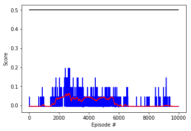

# Tennis Project


## Algorithm: Deep Deterministic Policy Gradient
The RL algorithm used to solve this project is Deep Deterministic Policy Gradient, which was introduced by DeepMind in the publication ["Continuous control with deep reinforcement learning"][paper].  

DDPG solves the problem of having a continuous action space.  
DDPG uses the Actor-Critic framework, but it is considered by some researchers as an extension of DQN since uses the target network key idea. The critic is used to approximate the maximizer over the *q-values* of the next state, instead of being used as a learned baseline.   

##### Actor
Is used to approximate the optimal policy ***deterministically***. It always outputs the best believed action. Stochastic methods on the other hand want to learn a probability distribution over actions.  
This actor is learning the *argmaxQ(s,a)* action.

##### Critic
It does the policy evaluation step. Therefore, it learns to evaluate the optimal action-value funtion by using the actors best believed actions.  

##### Replay Buffer
DDPG uses a Replay Buffer to decorrelate the tuples of experiences obtained sequentially.  
However, the uptades are slightly different than how the Replay Buffer works on other algorithms like DQN.  

This time, they are called ***soft updates***. 
This strategy consists on *slowly blending* the Regular Network weights into the Target weigths. Every timestep, the Target is 99% weights of its own and 1% the weights of the Regular Network.

This is opposed to the DQN implementation where the Target Network is updated every 10000 steps by coping the weights of the Regular Network into the Target Network. The Target Network then is fixed for a long time and then it sufferts a big update, intead of the slow blending mentioned above.


##### Hyperparameters Used
- MAXLEN = 100 *# Consecutive number of scores to Average*
- EPISODES = 3000
- BUFFER_SIZE = int(1e5)  *# replay buffer size*
- BATCH_SIZE = 1024       *# minibatch size*
- GAMMA = 0.99            *# discount factor*
- TAU = 1e-3              *# for soft update of target parameters*
- LR_ACTOR = 1e-4         *# learning rate of the actor*
- LR_CRITIC = 1e-4        *# learning rate of the critic*
- WEIGHT_DECAY = 0        *# L2 weight decay*

- UPDATE_EVERY = 10       *# Update weights every X timesteps*
- NUMBER_OF_UPDATES = 10  *# When update, learn X times*


```python

    Loading environmnet...
    
    +--------+--------------+-------------+
    | Epochs | Learn Period | Num Samples |
    +--------+--------------+-------------+
    | 10000  |      20      |     10      |
    +--------+--------------+-------------+


    INFO:unityagents:
    'Academy' started successfully!
    Unity Academy name: Academy
            Number of Brains: 1
            Number of External Brains : 1
            Lesson number : 0
            Reset Parameters :
    		
    Unity brain name: TennisBrain
            Number of Visual Observations (per agent): 0
            Vector Observation space type: continuous
            Vector Observation space size (per agent): 8
            Number of stacked Vector Observation: 3
            Vector Action space type: continuous
            Vector Action space size (per agent): 2
            Vector Action descriptions: , 


    Using brain TennisBrain
    Loading agent...
    
    Capacity of the Actor (# of parameters):  39554
    Capacity of the Critic (# of parameters):  105729
    Initializing training...
    
    Episode 100, Average last 100 scores: -0.00, Episode Duration: 2.00, 
    
    Episode 200, Average last 100 scores: -0.00, Episode Duration: 2.18, 
    
    Episode 300, Average last 100 scores: -0.00, Episode Duration: 2.08, 
    
    Episode 400, Average last 100 scores: -0.00, Episode Duration: 2.03, 
    
    Episode 500, Average last 100 scores: -0.00, Episode Duration: 2.04, 
    
    Episode 600, Average last 100 scores: -0.00, Episode Duration: 2.08, 
    
    Episode 700, Average last 100 scores: -0.00, Episode Duration: 2.23, 
    
    Episode 800, Average last 100 scores: -0.00, Episode Duration: 2.08, 
    
    Episode 900, Average last 100 scores: -0.00, Episode Duration: 2.07, 
    
    Episode 1000, Average last 100 scores: -0.00, Episode Duration: 2.08, 
    
    Episode 1100, Average last 100 scores: -0.00, Episode Duration: 2.35, 
    
    Episode 1200, Average last 100 scores: -0.00, Episode Duration: 2.12, 
    
    Episode 1300, Average last 100 scores: -0.00, Episode Duration: 2.16, 
    
    Episode 1400, Average last 100 scores: -0.00, Episode Duration: 2.15, 
    
    Episode 1500, Average last 100 scores: -0.00, Episode Duration: 2.14, 
    
    Episode 1600, Average last 100 scores: -0.00, Episode Duration: 2.17, 
    
    Episode 1700, Average last 100 scores: -0.00, Episode Duration: 2.12, 
    
    Episode 1800, Average last 100 scores: -0.00, Episode Duration: 2.13, 
    
    Episode 1900, Average last 100 scores: -0.00, Episode Duration: 2.20, 
    
    Episode 2000, Average last 100 scores: -0.00, Episode Duration: 2.16, 
    
    Episode 2100, Average last 100 scores: -0.00, Episode Duration: 2.17, 
    
    Episode 2200, Average last 100 scores: -0.00, Episode Duration: 2.38, 
    
    Episode 2300, Average last 100 scores: -0.00, Episode Duration: 2.18, 
    
    Episode 2400, Average last 100 scores: -0.00, Episode Duration: 2.25, 
    
    Episode 2500, Average last 100 scores: -0.00, Episode Duration: 2.20, 
    
    Episode 2600, Average last 100 scores: -0.00, Episode Duration: 2.19, 
    
    Episode 2700, Average last 100 scores: -0.00, Episode Duration: 2.28, 
    
    Episode 2800, Average last 100 scores: -0.00, Episode Duration: 2.22, 
    
    Episode 2900, Average last 100 scores: -0.00, Episode Duration: 2.19, 
    
    Episode 3000, Average last 100 scores: -0.00, Episode Duration: 2.27, 
    
    Episode 3100, Average last 100 scores: -0.00, Episode Duration: 2.42, 
    
    Episode 3200, Average last 100 scores: 0.00, Episode Duration: 2.33, 
    
    Episode 3300, Average last 100 scores: -0.00, Episode Duration: 2.25, 
    
    Episode 3400, Average last 100 scores: -0.00, Episode Duration: 2.36, 
    
    Episode 3500, Average last 100 scores: -0.00, Episode Duration: 2.25, 
    
    Episode 3600, Average last 100 scores: -0.00, Episode Duration: 2.27, 
    
    Episode 3700, Average last 100 scores: -0.00, Episode Duration: 2.29, 
    
    Episode 3800, Average last 100 scores: 0.01, Episode Duration: 2.30, 
    
    Episode 3900, Average last 100 scores: 0.02, Episode Duration: 3.80, 
    
    Episode 4000, Average last 100 scores: 0.03, Episode Duration: 4.61, 
    
    Closing envionment...
    
    'train'  9094048.72 ms
```    


## Results 

The previous submission without the corrections of these one, I reached 10.000 because I still had GPU hours.  
This was the results:


The current results are:  
  
It looks like this time the learning started later, I still don't know it will succeed or it will happen the same.  


## Future Improvements  

1 - Tuning of the hyperparameters to speed up training and increase performance.  
2 - Try different algorithms:
  [Continuous Deep Q-Learning with Model-based Acceleration][2] 

[paper]: https://arxiv.org/abs/1509.02971
[2]: https://arxiv.org/abs/1603.00748
