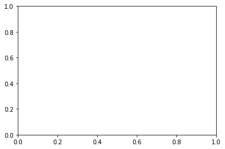

# Continuous Control Project
---


```python
!pip -q install ./python
```


```python
'''
Udacity Environment
===================
# select this option to load version 1 (with a single agent) of the environment
env = UnityEnvironment(file_name='/data/Reacher_One_Linux_NoVis/Reacher_One_Linux_NoVis.x86_64')

# select this option to load version 2 (with 20 agents) of the environment
# env = UnityEnvironment(file_name='/data/Reacher_Linux_NoVis/Reacher.x86_64')
'''
```


```python
import time
import torch
import numpy as np
from collections import deque
import matplotlib.pyplot as plt

from agent import Agent
from unityagents import UnityEnvironment
from utils import timeit, count_parameters
```

## [Reacher Envionment](https://youtu.be/2N9EoF6pQyE)


* Double-jointed arm which can move to target locations - Environment could be extend to manipulate several arms at the same time
* Goal: The agents must move it's hand to the goal location, and keep it there.
* Agents: The environment contains 20 agent linked to a single Brain.
* Agent Reward Function (independent):
  * +0.1 Each step agent's hand is in goal location.
* Brains: One Brain with the following observation/action space.
  * Vector Observation space: 26 variables corresponding to position, rotation,
    velocity, and angular velocities of the two arm Rigidbodies.
  * Vector Action space: (Continuous) Size of 4, corresponding to torque
    applicable to two joints.
  * Visual Observations: None.
* Benchmark Mean Reward: 30

One random Agent 
![1agent][agent1]

20 random Agents
![20agents][agent20]

[agent1]: https://github.com/PabloRR100/Reinforcement-Learning/blob/master/rlnd/p2_continuous-control/images/1_random_agents.gif?raw=true
[agent20]: https://github.com/PabloRR100/Reinforcement-Learning/blob/master/rlnd/p2_continuous-control/images/20_random_agents.gif?raw=true


```python
EPISODES = 300
MAX_ITERS = 1000
PRINT_EVERY = 100
LEARN_PERIOD = 20
NUM_SAMPLES = 10

# ENV = '/data/Reacher_One_Linux_NoVis/Reacher_One_Linux_NoVis.x86_64' # Environment with 1 agent
ENV = '/data/Reacher_Linux_NoVis/Reacher.x86_64' # Environment with 20 agents
```


```python
# Training
# --------

@timeit
def train(env, n_episodes=EPISODES, print_every=PRINT_EVERY):
    
    global EPISODES
    global MAX_ITERS
    global PRINT_EVERY
    global LEARN_PERIOD
    global NUM_SAMPLES
    
    print('Loading environmnet...\n')
    env = UnityEnvironment(file_name=ENV)
    brain_name = env.brain_names[0]
    brain = env.brains[brain_name]
    env_info = env.reset(train_mode=True)[brain_name]
    
    
    print('Loading agenst...\n')
    num_agents = len(env_info.agents)
    print('Number of Agents loaded: ', num_agents)
    state_size, action_size = brain.vector_observation_space_size, brain.vector_action_space_size
    agent = Agent(num_agents=num_agents, state_size=state_size, action_size=action_size)
    print('Capacity of the Actor (# of parameters): ', count_parameters(agent.actor_local))
    print('Capacity of the Critic (# of parameters): ', count_parameters(agent.critic_local))

    
    last_100_mean = []
    scores_global = []
    scores_concur = deque(maxlen=print_every)
    
    print('Initializing training...\n')
    for e in range(1, n_episodes+1):
        
        # Initialize Episode
        scores = np.zeros(num_agents)
        env_info = env.reset(train_mode=True)[brain_name]
        states = env_info.vector_observations                  # get the current state (for each agent)
        
        agent.reset()
        t0 = time.time()
        
        # Run episode maximum until MAX_ITERS
        for i in range(MAX_ITERS):
            
            # Select an action for each Agent
            actions = agent.act(states)
            env_info = env.step(actions)[brain_name]          
            
            # Observe result of the action
            next_states = env_info.vector_observations         
            rewards = env_info.rewards                         
            dones = env_info.local_done   
                     
            # Store score result
            scores += env_info.rewards                         
            
            # Make a step on the environment 
            for state, action, reward, next_state, done in zip(states, actions, rewards, next_states, dones):
                agent.step(state, action, reward, next_state, done)
            
            if i % PRINT_EVERY == 0:
                print('\rStep {}\tAverage Score: {:.2f}'.format(i, np.mean(scores)), end="")
                
            # Learn from experiences on the Replay Buffer 
            if i % LEARN_PERIOD == 0:
                for sample in range(NUM_SAMPLES):
                    agent.sampleandlearn()
            
            # End of the episode if any of the agents is done 
            if np.any(dones):                                  
                break
            
            # Roll over states to next time step
            states = next_states                               
            
        # agent.sampleandlearn() 
        deltatime = time.time() - t0
        
        score = np.mean(scores)
        scores_concur.append(score)
        scores_global.append(score)
        print('\rEpisode {}, Average last 100 scores: {:.2f}, Episode Duration: {:.2f}, \n'\
              .format(e, np.mean(scores_concur), deltatime))
        
        # If last 100 episodes average score is the best 100 average seen - Save Models
        if np.mean(scores_concur) > last_100_mean:
            torch.save(agent.actor_local.state_dict(), 'checkpoint_actor_{}.pth'.format(e))
            torch.save(agent.critic_local.state_dict(), 'checkpoint_critic_{}.pth'.format(e))
        
        # Update current 100 mean            
        last_100_mean = np.mean(scores_concur)
    
    print('Closing envionment...\n')
    env.close()
    return agent, scores_global
```


```python
cuda = torch.cuda.is_available()
gpus = True if torch.cuda.device_count() > 1 else False
ngpu = torch.cuda.device_count()
print('Cuda: ', cuda)
print('Gpus: ', ngpu)
```

    Cuda:  True
    Gpus:  1


```python
# Init Training
# -------------

agent, scores = train(ENV)
results = dict(agent=agent, scores=scores)
```

    Loading environmnet...
    


    INFO:unityagents:
    'Academy' started successfully!
    Unity Academy name: Academy
            Number of Brains: 1
            Number of External Brains : 1
            Lesson number : 0
            Reset Parameters :
    		goal_speed -> 1.0
    		goal_size -> 5.0
    Unity brain name: ReacherBrain
            Number of Visual Observations (per agent): 0
            Vector Observation space type: continuous
            Vector Observation space size (per agent): 33
            Number of stacked Vector Observation: 1
            Vector Action space type: continuous
            Vector Action space size (per agent): 4
            Vector Action descriptions: , , , 


    Loading agenst...
    
    Number of Agents loaded:  20
    Capacity of the Actor (# of parameters):  162436
    Capacity of the Critic (# of parameters):  108545
    Initializing training...
    
    Episode 1, Average last 100 scores: 0.01, Episode Duration: 561.76, 
    
    Episode 2, Average last 100 scores: 0.01, Episode Duration: 621.55, 
    
    Episode 3, Average last 100 scores: 0.01, Episode Duration: 631.52, 
    
    Episode 4, Average last 100 scores: 0.01, Episode Duration: 648.75, 
    
    Episode 5, Average last 100 scores: 0.01, Episode Duration: 655.82, 
    
    Episode 6, Average last 100 scores: 0.01, Episode Duration: 674.15, 
    
    Step 500	Average Score: 0.02


```python
# Save Results
# ------------

import pickle
with open('results.pickle', 'wb') as output:
    pickle.dump(scores, output, protocol=pickle.HIGHEST_PROTOCOL)
```


```python
fig = plt.figure()
ax = fig.add_subplot(111)
plt.plot(np.arange(1, len(scores)+1), scores)
plt.ylabel('Score')
plt.xlabel('Episode #')
plt.show()
```


    ---------------------------------------------------------------------------

    NameError                                 Traceback (most recent call last)

    <ipython-input-10-32d060b07928> in <module>()
          1 fig = plt.figure()
          2 ax = fig.add_subplot(111)
    ----> 3 plt.plot(np.arange(1, len(scores)+1), scores)
          4 plt.ylabel('Score')
          5 plt.xlabel('Episode #')


    NameError: name 'scores' is not defined





```python
## Load Trained Agent
## ------------------
#
#agent = Agent(state_size=state_size, action_size=action_size)
#agent.actor_local.load_state_dict(torch.load('checkpoint_actor.pth'))
#agent.critic_local.load_state_dict(torch.load('checkpoint_critic.pth'))
#
#with open('results.pickle', 'rb') as input:
#    scores = pickle.load(input)
#    
```
