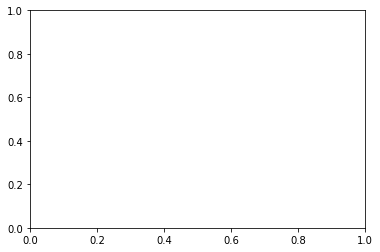

# Continuous Control Project
---


```python
!pip -q install ./python
```


```python
'''
Udacity Environment
===================
# select this option to load version 1 (with a single agent) of the environment
env = UnityEnvironment(file_name='/data/Reacher_One_Linux_NoVis/Reacher_One_Linux_NoVis.x86_64')

# select this option to load version 2 (with 20 agents) of the environment
# env = UnityEnvironment(file_name='/data/Reacher_Linux_NoVis/Reacher.x86_64')
'''
```


    "\nUdacity Environment\n===================\n# select this option to load version 1 (with a single agent) of the environment\nenv = UnityEnvironment(file_name='/data/Reacher_One_Linux_NoVis/Reacher_One_Linux_NoVis.x86_64')\n\n# select this option to load version 2 (with 20 agents) of the environment\n# env = UnityEnvironment(file_name='/data/Reacher_Linux_NoVis/Reacher.x86_64')\n"


```python
import torch
import numpy as np
from collections import deque
import matplotlib.pyplot as plt

from agent import Agent
from unityagents import UnityEnvironment
from utils import timeit, count_parameters
```


```python
EPISODES = 300
PRINT_EVERY = 100
# ENV = '/data/Reacher_One_Linux_NoVis/Reacher_One_Linux_NoVis.x86_64' # Environment with 1 agent
ENV = '/data/Reacher_Linux_NoVis/Reacher.x86_64' # Environment with 20 agents
```


```python
# Training
# --------

@timeit
def train(env, n_episodes=EPISODES, print_every=PRINT_EVERY):
    
    print('Loading environmnet...\n')
    env = UnityEnvironment(file_name=ENV)
    brain_name = env.brain_names[0]
    brain = env.brains[brain_name]
    env_info = env.reset(train_mode=True)[brain_name]
    
    
    print('Loading agenst...\n')
    num_agents = len(env_info.agents)
    print('Number of Agents loaded: ', num_agents)
    state_size, action_size = brain.vector_observation_space_size, brain.vector_action_space_size
    agent = Agent(num_agents=num_agents, state_size=state_size, action_size=action_size)
    print('Capacity of the Actor (# of parameters): ', count_parameters(agent.actor_local))
    print('Capacity of the Critic (# of parameters): ', count_parameters(agent.critic_local))

    
    last_100_mean = []
    scores_global = []
    scores_concur = deque(maxlen=print_every)
    
    print('Initializing training...\n')
    for e in range(1, n_episodes+1):
        
        j = 0
        # Initialize Episode
        scores = np.zeros(num_agents)
        env_info = env.reset(train_mode=True)[brain_name]
        states = env_info.vector_observations                  # get the current state (for each agent)
        
        agent.reset()
        
        while True:
            
            # Act in the enviromnet
            actions = agent.act(states)
            env_info = env.step(actions)[brain_name]          
            
            # Observe result of the action
            next_states = env_info.vector_observations         
            rewards = env_info.rewards                         
            dones = env_info.local_done   
                     
            # Store score result
            scores += env_info.rewards                         
            
            for state, action, reward, next_state, done in zip(states, actions, rewards, next_states, dones):
                agent.step(state, action, reward, next_state, done)
            
            if j % print_every == 0:
                print('\rStep {}\tAverage Score: {:.2f}'.format(j, np.mean(scores)), end="")
            
            if np.any(dones):                                  # End of the episode
                break
            
            states = next_states                               # roll over states to next time step
            j += 1
            
        agent.sampleandlearn()
        
        score = np.mean(scores)
        scores_concur.append(score)
        scores_global.append(score)
        print('\rEpisode {}, Mean last 100 scores: {:.2f}, Mean current score: {:.2f}, \n'\
              .format(e, np.mean(scores_concur), score))
        
        if np.mean(scores_concur) > last_100_mean:
            torch.save(agent.actor_local.state_dict(), 'checkpoint_actor_{}.pth'.format(e))
            torch.save(agent.critic_local.state_dict(), 'checkpoint_critic_{}.pth'.format(e))
            
        last_100_mean = np.mean(scores_concur)
    
    print('Closing envionment...\n')
    env.close()
    return agent, scores_global
```


```python
cuda = torch.cuda.is_available()
gpus = True if torch.cuda.device_count() > 1 else False
ngpu = torch.cuda.device_count()
print('Cuda: ', cuda)
print('Gpus: ', ngpu)
```

    Cuda:  True
    Gpus:  1


```python
# Init Training
# -------------

agent, scores = train(ENV, EPISODES, PRINT_EVERY)
results = dict(agent=agent, scores=scores)
```

    Loading environmnet...
    


    INFO:unityagents:
    'Academy' started successfully!
    Unity Academy name: Academy
            Number of Brains: 1
            Number of External Brains : 1
            Lesson number : 0
            Reset Parameters :
    		goal_speed -> 1.0
    		goal_size -> 5.0
    Unity brain name: ReacherBrain
            Number of Visual Observations (per agent): 0
            Vector Observation space type: continuous
            Vector Observation space size (per agent): 33
            Number of stacked Vector Observation: 1
            Vector Action space type: continuous
            Vector Action space size (per agent): 4
            Vector Action descriptions: , , , 


    Loading agent...
    
    Capacity of the Actor (# of parameters):  9732
    Capacity of the Critic (# of parameters):  108545
    Initializing training...
    
    Episode 1, Mean last 100 scores: 0.05, Mean current score: 0.05, 
    
    Episode 2, Mean last 100 scores: 0.08, Mean current score: 0.11, 
    
    Episode 3, Mean last 100 scores: 0.06, Mean current score: 0.00, 
    
    Episode 4, Mean last 100 scores: 0.04, Mean current score: 0.01, 
    
    Episode 5, Mean last 100 scores: 0.04, Mean current score: 0.00, 
    
    Episode 6, Mean last 100 scores: 0.03, Mean current score: 0.01, 
    
    Episode 7, Mean last 100 scores: 0.03, Mean current score: 0.02, 
    
    Episode 8, Mean last 100 scores: 0.03, Mean current score: 0.01, 
    
    Episode 10, Mean last 100 scores: 0.03, Mean current score: 0.02, 
    
    Episode 11, Mean last 100 scores: 0.02, Mean current score: 0.00, 
    
    Episode 12, Mean last 100 scores: 0.02, Mean current score: 0.00, 
    
    Episode 13, Mean last 100 scores: 0.02, Mean current score: 0.00, 
    
    Episode 14, Mean last 100 scores: 0.02, Mean current score: 0.01, 
    
    Episode 15, Mean last 100 scores: 0.02, Mean current score: 0.01, 
    
    Episode 16, Mean last 100 scores: 0.02, Mean current score: 0.01, 
    
    Episode 17, Mean last 100 scores: 0.02, Mean current score: 0.01, 
    
    Episode 18, Mean last 100 scores: 0.02, Mean current score: 0.00, 
    
    Episode 19, Mean last 100 scores: 0.02, Mean current score: 0.00, 
    
    Episode 20, Mean last 100 scores: 0.02, Mean current score: 0.00, 
    
    Episode 21, Mean last 100 scores: 0.01, Mean current score: 0.01, 
    
    Episode 22, Mean last 100 scores: 0.01, Mean current score: 0.01, 
    
    Episode 23, Mean last 100 scores: 0.01, Mean current score: 0.00, 
    
    Step 500	Average Score: 0.00


    ---------------------------------------------------------------------------

    KeyboardInterrupt                         Traceback (most recent call last)

    <ipython-input-7-8b2d8888da5c> in <module>()
          2 # -------------
          3 
    ----> 4 agent, scores = train(ENV, EPISODES, PRINT_EVERY)
          5 results = dict(agent=agent, scores=scores)


    /home/workspace/utils.py in timed(*args, **kw)
          8     def timed(*args, **kw):
          9         ts = time.time()
    ---> 10         result = method(*args, **kw)
         11         te = time.time()
         12         if 'log_time' in kw:


    <ipython-input-5-21adb36a670f> in train(env, n_episodes, print_every)
         50 
         51             for state, action, reward, next_state, done in zip(states, actions, rewards, next_states, dones):
    ---> 52                 agent.step(state, action, reward, next_state, done)
         53 
         54             if j % print_every == 0:


    /home/workspace/agent.py in step(self, state, action, reward, next_state, done)
         67         if len(self.memory) > BATCH_SIZE:
         68             experiences = self.memory.sample()
    ---> 69             self.learn(experiences, GAMMA)
         70 
         71     def sampleandlearn(self):


    /home/workspace/agent.py in learn(self, experiences, gamma)
        119         self.critic_optimizer.zero_grad()
        120         critic_loss.backward()
    --> 121         self.critic_optimizer.step()
        122 
        123         # ---------------------------- update actor ---------------------------- #


    /opt/conda/lib/python3.6/site-packages/torch/optim/adam.py in step(self, closure)
         91                 # Decay the first and second moment running average coefficient
         92                 exp_avg.mul_(beta1).add_(1 - beta1, grad)
    ---> 93                 exp_avg_sq.mul_(beta2).addcmul_(1 - beta2, grad, grad)
         94                 if amsgrad:
         95                     # Maintains the maximum of all 2nd moment running avg. till now


    KeyboardInterrupt: 


```python
import pickle
with open('results.pickle', 'wb') as output:
    pickle.dump(scores, output, protocol=pickle.HIGHEST_PROTOCOL)
```


    ---------------------------------------------------------------------------

    NameError                                 Traceback (most recent call last)

    <ipython-input-9-0079d0a6756c> in <module>()
          1 import pickle
          2 with open('results.pickle', 'wb') as output:
    ----> 3     pickle.dump(scores, output, protocol=pickle.HIGHEST_PROTOCOL)
    

    NameError: name 'scores' is not defined


```python
fig = plt.figure()
ax = fig.add_subplot(111)
plt.plot(np.arange(1, len(scores)+1), scores)
plt.ylabel('Score')
plt.xlabel('Episode #')
plt.show()
```


    ---------------------------------------------------------------------------

    NameError                                 Traceback (most recent call last)

    <ipython-input-10-32d060b07928> in <module>()
          1 fig = plt.figure()
          2 ax = fig.add_subplot(111)
    ----> 3 plt.plot(np.arange(1, len(scores)+1), scores)
          4 plt.ylabel('Score')
          5 plt.xlabel('Episode #')


    NameError: name 'scores' is not defined





```python
## Load Trained Agent
## ------------------
#
#agent = Agent(state_size=state_size, action_size=action_size)
#agent.actor_local.load_state_dict(torch.load('checkpoint_actor.pth'))
#agent.critic_local.load_state_dict(torch.load('checkpoint_critic.pth'))
#
#with open('results.pickle', 'rb') as input:
#    scores = pickle.load(input)
#    
```
